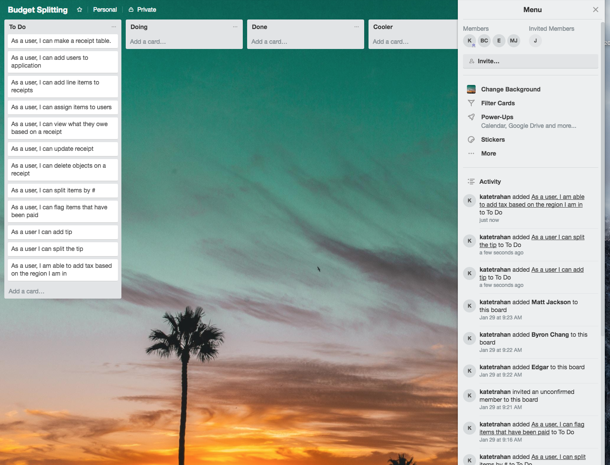
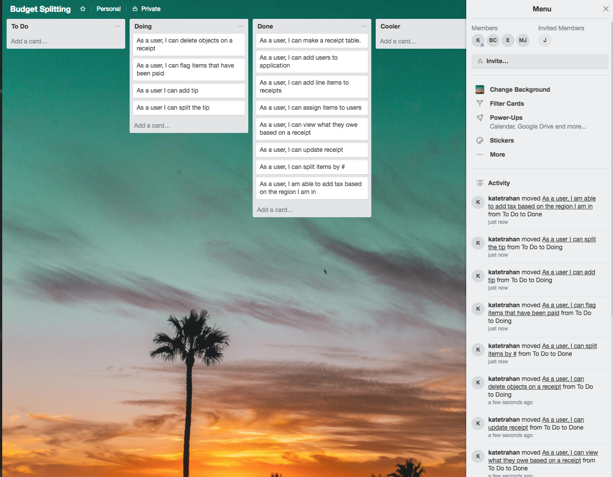

# BillSplit

 This app divides bills into itemized receipts. The purpose of this app is to create an easy way to divide up the bill whether it be for a restaurant or family vacation.

## Getting Started

To run this application you will need to clone/download the contents of the repository and compile them through IntelliJ IDEA.

Once the application is running, open index.html with a browser. (located in html folder)

### Prerequisites

You will need the following packages and software installed:

```
Java JDK 1.8.0_151
JAVA JRE 1.8.0_151
IntelliJ IDEA
```
### Specifications
| Behavior | Input | Expected Behavior |
| :------------- | :------------- | :------------- |
| Adds users to application | "User 1" | "User 1" |
| Adds a receipt to the application | Add receipt | Receipt added |
| Adds a company for the receipt that was received | "Target" | Store: "Target" |
| Adds items to the receipt | "Nachos" | "Nachos" |
| Adds cost to items in the receipt | "Nachos - $5.99" | " Nachos - $5.99" |
| Assigns items to users | "Nachos - User 1" | "Nachos- User 1" |
| Adds total cost of receipt | "$4,$1,$5" | "$10" |
| Splits receipt costs by user| "$10 total, divided by 2" | "$5,$5" |
| View items by user | "User 1" | "User 1 = $3, $4, $2"|
| Add sales tax by state | "Oregon" | "$0" |
| Keeps track of users who participated in receipt | Add user to application | User is added to the h2 SQL database |
| Keeps track of all Receipts added to app | A receipt is added through form | Receipt is given unique ID and is added to H2 SQL database |
| Keeps track of items added to app | An item is added through form | Items are added to H2 SQL database and given ids to match receipts |

### Trello Board
Start of project:


Progress:



## Built With

* [IntelliJ IDEA](https://www.jetbrains.com/idea/) - JAVA IDE

## Authors

* **Byron Chang** - [thebyronc](https://github.com/thebyronc/)
* **Jun Lee** - [june11084](https://github.com/june11084)
* **Edgar Hernandez** - [Edgarcho](https://github.com/Edgarcho)
* **Matt Jackson** - [madjacks12](https://github.com/madjacks12)
* **Kate Trahan** - [katetrahan](https://github.com/katetrahan)

## License

This project is licensed under the MIT License - see the [LICENSE.md](LICENSE.md) file for details
